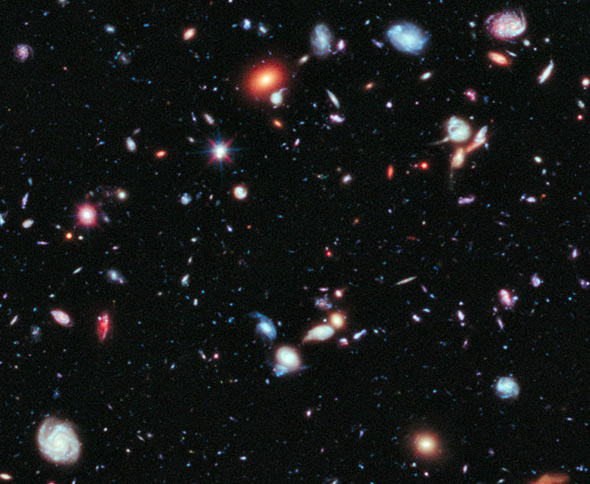

# DeepSpacePad
A generative music composer in your browser that uses the Web Audio API to create and play ethereal harmonies. Click for Demo: https://erichlof.github.io/DeepSpacePad/DeepSpacePad.html 

 

<h3>How is this done?</h3>
The sounds that you hear are entirely made from scratch in the browser - no recordings are used!  Using the Web Audio API, brown noise (a smoother variation on plain white noise) is constructed in an audio source buffer.  This buffer is then fed through a band pass filter.  Band pass filters only allow a narrow range of frequencies to pass through, any frequencies outside of this band are attenuated according to the filter's 'Q' parameter.  The Q parameter specifies how narrow the band of frequencies is that it will allow to pass through.  The result is an ethereal airy, smooth-wind or low whistle sound.  Multiple copies of this wind instrument are made, one for each note of the 'deep space' instrument.  The A.I. composer makes a choice of what scale/mode will be used, and then certain random values are chosen for key transposition, octave range, etc..  Loop all of this every 30 seconds or so (adjustable), and you have a complete generative space orchestra and composer inside your browser!

 

<h3>Inspiration for this project</h3>
I was influenced by the haunting space music in 2001 A Space Odyssey, Interstellar, Star Trek (The Original Series), space documentaries, and other films/TV shows.  I am a professional musician and since computer programming is my #1 hobby, what better way to combine my two passions - hence this Deep Space Pad project!

 

<h3>Updates</h3>

March 29, 2018: Initial Commit

<h3>Future Plans</h3>

* I want to explore melodic automatic composition rather than just harmonies.  This is much more difficult to make convincing though.  
* I might start with a Wind Chime type machine that randomly plays pleasing tones, then I'll try to refine this process to have more organization in the composition.
* Explore different rhythm generation algorithms and combine this with the harmony and melody making process.
* Eventually, way down the line, have the entire film score-type music composing process automated. Realistically, I don't know how far I can take this, but it's fun to think about and explore! :-)
